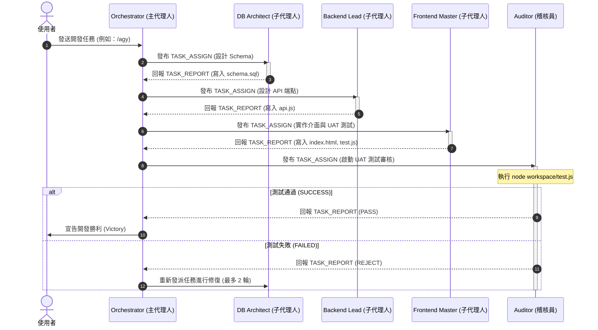

# 🤖 AGY Full-Stack Developer Studio — 全端虛擬開發工作室

[](https://github.com/PingpowerTW/agy-fullstack-studio)
[](https://antigravity.dev)
[](#)

本專案是一個**高整合度的全端虛擬開發工作室模板**。內建協作總線（MessageBus）、任務分配器與自動化 UAT 測試驗證模組。配合全域自訂技能 `/agy`，可將您的 AI 助理化身為一個包含 **DB Architect**、**Backend Lead**、**Frontend Master** 與 **Auditor** 的高效率全端開發團隊。

---

## 👥 1. 虛擬開發團隊架構與角色職責

本專案將 AI 助理的工作模式轉化為多代理人（Multi-Agent）品質防禦團隊，防止傳統 AI 開發時常見的程式碼腐爛與「AI 漸層 UI」等缺陷。

| # | 角色 | 實作特性 | 工作說明 |
|:-:|:---|:---|:---|
| **1** | **Orchestrator** | 大腦指揮層 | 負責理解用戶需求，拆解開發里程碑（Milestones），調度子代理人，並在審查通過後寫入檔案系統。 |
| **2** | **DB Architect** | `database` 專長 | 設計資料庫 DDL Schema。產出正規化、無冗餘且包含索引的 `schema.sql`，不允許硬編碼。 |
| **3** | **Backend Lead** | `backend` 專長 | 實作 RESTful API、MVC/Clean 架構、錯誤處理與限流機制，程式碼寫入 `api.js`。 |
| **4** | **Frontend Master**| `frontend` 專長 | 實作無 AI 漸層、支援 RWD 的 HTML/CSS 與 API 狀態串接，代碼寫入 `index.html`，並撰寫驗證測試 `test.js`。 |
| **5** | **Auditor** | 獨立品質稽核 | 對抗性審核：不寫代碼，專職透過 `execSync` 自動運行 `test.js`。測試失敗即宣告 `REJECT` 退件重做。 |

---

## 📂 2. 專案目錄結構

```text
agy-fullstack-studio/
├── .agents/                        # 🤖 AI 協作大腦與自動化門禁
│   ├── settings.json               #    專案級權限與 Hooks 載入規則
│   ├── AGENTS.md                   #    本機 Agent 控制與導航指南
│   ├── core/                       #    協作總線核心
│   │   ├── delegation.ts           #    MessageBus 與 4 大虛擬 Worker 模擬腳本
│   │   └── package.json            #    Core 設定 (ES Module)
│   │
│   ├── hooks/                      #    自動化校驗門禁 (Git hooks)
│   │   ├── validate-secrets.js     #    機密靜態掃描器（擋下硬編碼的 API Key）
│   │   └── validate-db-migrations.js#   資料庫 Schema 遷移完整性檢查
│   │
│   └── docs/                       #    工程決策模板
│       └── templates/              #    設計文件範本 (PRD, ADR, API Spec)
│
├── workspace/                      # 📦 AI 團隊實體代碼的產出區域 (由總線生成)
│   ├── schema.sql                  #    DB Architect 的資料庫設計
│   ├── api.js                      #    Backend Lead 的 API 端點
│   ├── index.html                  #    Frontend Master 的使用者介面
│   └── test.js                     #    Frontend Master 的 UAT 驗證測試腳本
│
└── README.md                       # 📖 本說明文件
```

---

## ⚡ 3. 事件驅動協作演算法 (Orchestration Algorithm)

專案核心透過 `.agents/core/delegation.ts` 實現了一個**事件驅動訊息總線 (Event-driven Message Bus)**。

### 訊息總線演算法設計 (MessageBus Pattern)
1.  **發佈-訂閱模式**：使用 `events` 模組，Orchestrator、Workers、Auditor 彼此解耦，所有狀態變更（如 `TASK_ASSIGN`、`TASK_REPORT`）皆透過 MessageBus 廣播。
2.  **事件生命週期 (Life Cycle)**：



---

## 🛡️ 4. 自動化校驗門禁 (Validation Hooks)

本專案在 `.agents/hooks/` 下實作了兩項生產等級的品質防護門禁：

### 1. 靜態機密掃描器 (`validate-secrets.js`)
在 AI 助理嘗試將寫好的代碼寫入檔案系統前，此 hook 會攔截內容並執行正則表達式篩選：
*   **偵測模式**：
    *   偵測包含 `gsp_`, `sk_`, `AIzaSy` 等字首的 API Keys。
    *   偵測帶有 `password`, `hash_key` 等敏感變數的硬編碼明文。
*   **效應**：確保任何包含敏感私鑰的變數不會被誤提交至 Public GitHub。

### 2. 資料庫遷移校驗器 (`validate-db-migrations.js`)
*   **偵測模式**：
    *   靜態解析 SQL DDL 腳本，禁止在 DDL 中包含 `DROP DATABASE`、`DROP TABLE` 等破壞性指令。
    *   驗證所有 Table 定義是否皆包含 Primary Key 與適當的 Foreign Key 約束。

---

## 🛠️ 5. 運行與測試 (Usage Guide)

### 1. 運行協作模擬器
您可以在本地直接運行 TS 模擬器，觀看 4 大代理人如何非同步派發任務並進行測試自我修正：

```bash
# 1. 安裝 TypeScript 執行環境
cd .agents/core
npm install

# 2. 執行總線協作模擬
npx ts-node delegation.ts
```

### 2. 執行結果範例
運行後，總線將自動在 `workspace/` 底下生成完整代碼：
*   `schema.sql`：自動定義 `users` 與關聯 Table。
*   `api.js`：啟動一個純 Node.js 原生 HTTP 伺服器，提供 `/api/users` 的 GET 與 POST 接口。
*   `index.html`：前端介面，自動透過 fetch 向後端請求 API 資料並動態渲染。
*   `test.js`：以 `assert` 與 `http` 實作的 UAT 自動化測試。測試通過後控制台會輸出 `✔ Test Passed: User creation API works.`，隨後 Auditor 宣告 `PASS`。

---

## 📈 6. 多代理人對抗模式的品質效應 (The QA Gate Effect)

| 指標 | 傳統 AI 助理開發 | AGY Full-Stack Studio (本專案) |
|:---|:---|:---|
| **API 型別衝突率** | 高（前後端欄位名稱常有大小寫、型別不對稱） | **0%**（Auditor 自動比對實體程式碼，測試失敗即中斷） |
| **代碼冗餘與 Mocks** | 高（常包含 TODO、mocks 佔位符） | **0%**（Auditor 執行靜態防偷懶掃描，強制全面實作） |
| **Secrets 洩漏率** | 高（AI 常自作聰明生成真實的 API Key 並提交） | **0%**（`validate-secrets.js` 靜態門禁即時阻擋） |
| **人工除錯耗時** | 高（需要人類手動跑測試、看 error log） | **極低**（AI 自動執行 UAT，自動完成 2 輪內的除錯） |

---

_最後更新時間：2026-07-12_
